  
  
  

---

### 👨‍💻 About me

- 🔌 3 years building **[One](https://withone.ai)**, the integration layer that gives AI agents access to 900+ APIs
- 🛡️ Building a multi-tenant **GRC platform** for a Big Four firm with Next.js, Django & Azure Kubernetes
- 🦀 Working across One's **Rust** core: OAuth, credential checks, composed actions
- 🤖 Automating my own delivery pipeline with **Claude Code** skills & agents
- 🎨 Side quest: **[SoftUI](https://github.com/siddharth-bhansali/softui)**, a neumorphic CSS library with 77+ components and zero dependencies
- 💬 Ask me about **API integrations, OAuth, Rust, AI agents, MCP**

 

### 🚀 Highlights at One

<table>
  <tr><td nowrap>🔌 <b>420+</b></td><td>of One's 937 live API integrations built or rebuilt by me (~45% of the catalogue)</td></tr>
  <tr><td nowrap>🧠 <b>1</b></td><td>AI pipeline that turns API docs into agent-ready integrations, built from v1 through two rewrites</td></tr>
  <tr><td nowrap>🔐 <b>30+</b></td><td>OAuth connectors, from Jira and Notion to Microsoft Teams, plus native token handlers in Rust</td></tr>
  <tr><td nowrap>📉 <b>70%</b></td><td>smaller AI-agent knowledge payloads, so lower LLM token cost</td></tr>
  <tr><td nowrap>🚢 <b>1,000+</b></td><td>pull requests across 30+ repos, 3,000+ commits</td></tr>
</table>

### 🛠️ Tech stack

  
   
  

  
  
  
  

### 📈 Activity

  

  <picture>
    <source media="(prefers-color-scheme: dark)" srcset="https://raw.githubusercontent.com/siddharth-bhansali/siddharth-bhansali/output/snake-dark.svg" />
    
  </picture>

